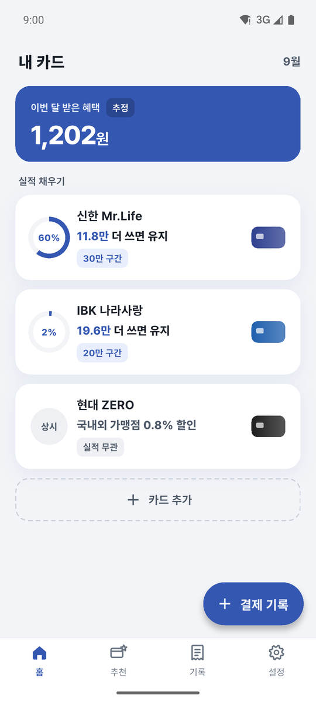
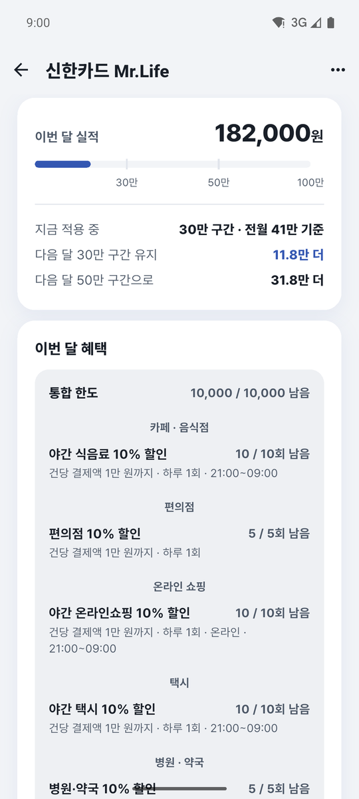
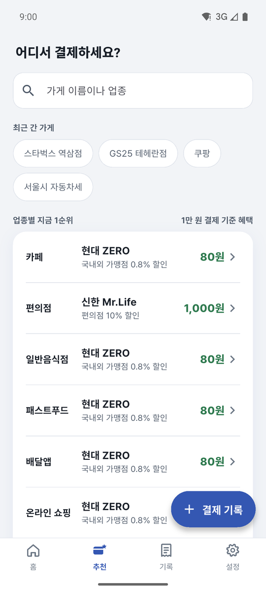
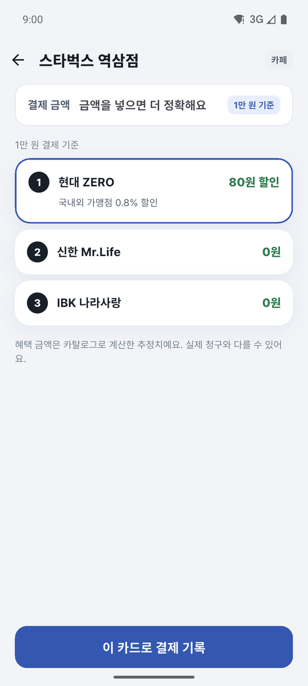
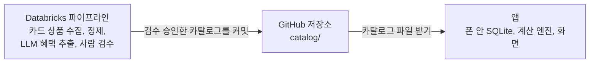

<div align="center">


# 체리컨슘

체리피커를 위한 카드 실적·혜택 관리 앱입니다.<br>
이번 달 실적은 얼마 남았고, 이 가게에선 어느 카드를 낼지 알려 줍니다.

[](https://github.com/limbs-han/CherryConsume/actions/workflows/test.yml)


| 홈 | 카드 상세 | 추천 | 가게별 순위 |
|:---:|:---:|:---:|:---:|
|  |  |  |  |

<sub>화면 사진의 결제 내역은 지어낸 것입니다</sub>

</div>

> [!NOTE]
> 로그인 없이 씁니다. 결제 기록과 계산은 폰 안에만 있어 인터넷이 없는 계산대 앞에서도 추천이 뜹니다. 카드번호는 받지 않습니다.

## 소개

카드를 여러 장 쓰다 보면 이번 달 전월실적이 얼마나 찼는지, 지금 이 가게에서는 어느 카드를 내는 게 나은지 헷갈리기 쉽습니다. 체리컨슘은 이 두 가지를 알려주는 앱입니다.

## 기능

| 기능 | 설명 |
|---|---|
| 카드 등록 | 카드사와 상품명으로 검색합니다 |
| 결제 기록 | 금액과 가게, 카드를 직접 입력하거나 카드사 웹에서 받은 이용 내역 엑셀을 올립니다. 저장하기 전에 예상 혜택과 실적 인정 여부를 보여줍니다 |
| 실적 현황 | 카드마다 이번 달 인정 실적과 다음 구간까지 남은 금액을 보여줍니다 |
| 가게별 추천 | 추천 탭 첫 화면에서 최근 간 가게와 업종별 1순위 카드를 바로 보여 줍니다. 가게를 고르면 보유한 카드를 기대 혜택 금액 순으로 정렬하고, 조금 더 쓰면 받을 수 있는 혜택도 알려 줍니다 |

결제 내역은 사용자가 직접 입력하거나 엑셀로 올립니다. 마이데이터는 쓰지 않습니다.

출시 뒤에는 Android에서 부가 기능을 켤 수 있게 할 예정입니다. 카드사 앱, 토스, 문자의 결제 알림을 폰 안에서 읽어 기록 초안을 만들어 두고, 앱을 켜면 확인한 결제만 저장합니다. 알림 내용은 폰 밖으로 보내지 않습니다.

폰을 바꿀 때는 설정에서 기록을 파일로 내보내 새 폰에서 가져옵니다.

## 현재 상태

카탈로그 2판과 카드 20장, 계산 엔진, 카드 상품 수집 파이프라인을 만들었습니다. 앱은 서버 없이 폰 안에서 저장하고 계산하며, 2026-10-04 실제 폰에서 카드 등록부터 엑셀 가져오기까지 확인했습니다. 2026-10-05 화면 다듬기를 마치고 지금은 Play 스토어 출시를 준비합니다.

## 문서

| 문서 | 내용 |
|---|---|
| [설계 문서](docs/2026-09-19-cherryconsume-design.md) | 확정한 결정과 제약, 전체 구조, 계산 엔진 설계 |
| [ERD](docs/erd.md) | 폰 안 SQLite 표 10개. [렌더 페이지](docs/erd.html) |
| [시나리오와 예외](docs/scenarios.md) | 주요 시나리오 12개, 예외 57개, 운영 예외 4개 |
| [출시 서명과 실제 폰](docs/release-setup.md) | 출시 서명 키 만들기, 실제 폰에 깔기, 기록 지키기 |
| [Databricks를 고른 이유](docs/databricks.md) | 이 프로젝트에서 하는 일, 다른 레이크하우스와 비교, 비용과 제약, 설정 순서 |
| [와이어프레임](design/wireframes.html) | 초기 저해상도 화면 9개. 흐름 기록용이고 최신 화면은 아래 시안 |
| [화면 시안 PDF](design/체리컨슘-화면-시안.pdf) | 고해상도 화면 14개. 시작, 첫 시작 홈, 홈, 카드 등록, 카메라 인식, 카드 상세, 결제 기록, 추천, 추천 결과, 기록, 엑셀 가져오기, 미리보기, 설정, 상태 모음. 카메라 인식 화면은 기능을 빼서 만들지 않습니다 |
| [화면 시안 HTML](design/체리컨슘-화면-시안.html) | 같은 14개를 한 파일에. 브라우저에서 열면 화면 사이를 눌러 이동하고 확대·축소 가능 |

## 기술 스택

| 분야 | 기술 | 하는 일 |
|---|---|---|
| 앱 |     | Android 먼저. 폰 안 SQLite에 기록하고 Dart 계산 엔진으로 실적과 추천을 계산합니다 |
| 데이터 파이프라인 |     | 카드사 상품 정보를 모아 LLM으로 혜택을 뽑고, 사람이 검수한 뒤 카탈로그로 냅니다 |
| 자동화 |   | 시험, 파이프라인 배포, 카탈로그 내보내기, 개인정보처리방침 쪽 |
| 서버 | 없음 | 앱이 인터넷으로 하는 일은 공개 저장소의 카탈로그 파일 받기 하나입니다 |

## 구조



- 실적과 추천은 폰 안에서 계산합니다. 결제 기록은 폰 밖으로 나가지 않습니다.
- 파이프라인이 카드사에서 상품 정보를 모아 카탈로그를 만들고 저장소에 커밋합니다. 앱은 담긴 카탈로그를 쓰다가 인터넷이 되면 새 파일을 받습니다.

## 진행 순서

| 단계 | 내용 | 상태 |
|---|---|---|
| 0 | 기획. 설계, ERD, 와이어프레임, 시나리오 | 완료 |
| 1 | 카탈로그 스키마와 실적·추천 계산 엔진 | 완료 |
| 2 | 앱 MVP. 서버와 로그인으로 만든 뒤 폰 안 저장과 계산으로 바꿈. 화면 다듬기 | 실제 폰 확인 완료. 실제 카드사 엑셀 확인 남음 |
| 3 | 카드 상품 수집 파이프라인 | 완료 |
| 4 | 카메라 카드 인식 | 뺌 |
| 5 | 출시 준비 | 진행 중 |
| 6 | 결제 알림 읽기. 출시 뒤 Android 부가 기능 | 예정 |

카탈로그 스키마가 추천 계산에 맞는지 카드 20장으로 먼저 확인해 보려고 1단계를 앞에 뒀습니다. 수천 장을 모은 뒤에 스키마를 고치면 되돌리기 어렵습니다.

## 폴더

<details>
<summary>폴더 구조 펼치기</summary>

```
cherryConsume/
├── docs/          기획 문서
│   ├── work/      작업 단위별 의도, 설계, 계획
│   └── history/   요청과 수정 요청, 결과를 작업마다 남긴 기록
├── design/        와이어프레임, 아이콘
├── backend/       카탈로그 읽기와 검사, 파이프라인 Python 코드
├── app/           Flutter 앱. 계산 엔진과 폰 안 저장소
├── catalog/       카드 상품 정의 파일. 원본은 Databricks 골드이고 승인된 개정을 봇이 커밋한다
├── pipeline/      Databricks 번들. 카드 상품 수집 파이프라인과 검수 앱
├── .github/       GitHub Actions. 원문 수집, 파이프라인 배포, 카탈로그 내보내기, 시험
├── .claude/       AI 작업 규칙, 스킬, 자동 검사
└── .githooks/     커밋 메시지와 민감 정보 검사
```

</details>
