# 체리컨슘 ERD

Postgres 기준. 설계 문서 6.3절의 Pydantic 모델을 테이블로 옮기고, 3계층 구조에 필요한 사용자·인증·추천 기록 테이블을 더했다.

두 영역으로 나뉜다.
- 카탈로그 영역: 파이프라인이 쓰고 앱은 읽기만 한다. `cards`부터 `merchant_aliases`까지.
- 사용자 영역: 앱이 쓴다. `users`부터 `export_runs`까지.

```mermaid
erDiagram
    issuers {
        text code PK "shinhan, samsung, ibk ..."
        text name
    }
    categories {
        text code PK "cafe, convenience, tax ..."
        text name_ko
        text kakao_group_code "CE7 등. 없으면 null"
    }
    cards {
        text id PK "issuer-slug"
        text issuer_code FK
        text name
        text kind "credit | check"
        int annual_fee_domestic
        int annual_fee_global
        bool active
        text source_url
        date updated_at
        text spend_basis "prev_calendar_month | unsupported"
        int catalog_version
    }
    spend_tiers {
        text card_id PK,FK
        int tier_index PK "0부터"
        int min_spend
        int integrated_cap "null이면 통합 한도 없음"
    }
    spend_rules {
        text card_id PK,FK
        bool exclude_interest_free_installment
        bool exclude_discounted
        text installment_basis "full_at_purchase | per_installment_month"
        text cancellation_basis "cancel_month | original_month"
    }
    spend_rule_excluded_categories {
        text card_id PK,FK
        text category_code PK,FK
    }
    benefits {
        bigint id PK
        text card_id FK
        text key "카드 안에서 고유"
        text title
        text target_type "category | merchant | all"
        text channel "online | offline | any"
        text kind "discount | points | cashback"
        numeric rate_pct "정률. fixed_amount와 둘 중 하나"
        int fixed_amount
        int min_txn_amount
        int max_per_txn
        int monthly_cap_amount
        int monthly_cap_count
        int daily_cap_count
        int min_tier_index
        bool counts_toward_integrated_cap
        bool conditions_not_modeled "계산에 안 넣은 조건 있음"
        bool active "카탈로그 교체로 사라지면 false"
        text notes
    }
    benefit_targets {
        bigint benefit_id PK,FK
        text target_value PK "업종 코드 또는 가맹점 키"
    }
    merchants {
        text key PK "starbucks, gs25 ..."
        text name
        text category_code FK
    }
    merchant_aliases {
        text alias PK "공백·대소문자 정규화한 값"
        text merchant_key FK
    }

    users {
        uuid id PK
        text email UK "소셜 로그인만 쓰면 null"
        timestamptz created_at
        timestamptz deleted_at "탈퇴 시각. 30일 뒤 물리 삭제"
    }
    auth_identities {
        bigint id PK
        uuid user_id FK
        text provider "email | kakao | google"
        text provider_uid UK "provider와 함께 고유"
        text password_hash "email일 때만"
        timestamptz created_at
    }
    user_cards {
        uuid id PK
        uuid user_id FK
        text card_id FK
        text nickname
        int assumed_prev_month_spend "등록한 달의 전월 실적 추정"
        timestamptz added_at
        timestamptz removed_at
    }
    transactions {
        uuid id PK
        uuid user_id FK
        uuid user_card_id FK
        int amount
        text merchant_name "사용자가 적은 이름"
        text merchant_key FK "별칭표에 걸리면"
        text category_code FK
        timestamptz paid_at
        int installment_months "일시불 1"
        bool interest_free_installment
        int cancelled_amount "기본 0"
        timestamptz cancelled_at
        text channel "online | offline"
        bigint applied_benefit_id FK "입력 시점 계산값"
        int estimated_benefit "입력 시점 계산값"
        uuid recommendation_request_id FK "추천에서 바로 기록했으면"
        timestamptz created_at
        timestamptz updated_at
        timestamptz deleted_at
    }
    recommendation_requests {
        uuid id PK
        uuid user_id FK
        text merchant_name
        text merchant_key FK
        text category_code FK
        int amount "없으면 null"
        text channel
        timestamptz requested_at
    }
    recommendation_results {
        uuid request_id PK,FK
        int rank PK "1부터"
        uuid user_card_id FK
        int expected_benefit
        bigint applied_benefit_id FK
        text[] warnings
    }
    card_requests {
        bigint id PK
        uuid user_id FK
        text issuer_text "사용자가 적은 카드사"
        text card_name_text "사용자가 적은 카드 이름"
        timestamptz created_at
    }
    export_runs {
        bigint id PK
        date target_date UK "내보낸 날짜"
        text status "running | done | failed"
        text file_prefix "오브젝트 스토리지 경로"
        int transaction_rows
        int request_rows
        timestamptz started_at
        timestamptz finished_at
    }

    issuers ||--o{ cards : "발행"
    cards ||--|{ spend_tiers : "실적 구간"
    cards ||--|| spend_rules : "실적 규칙"
    cards ||--o{ spend_rule_excluded_categories : "제외 업종"
    categories ||--o{ spend_rule_excluded_categories : ""
    cards ||--o{ benefits : "혜택"
    benefits ||--o{ benefit_targets : "대상"
    categories ||--o{ merchants : "업종"
    merchants ||--o{ merchant_aliases : "별칭"

    users ||--|{ auth_identities : "로그인 수단"
    users ||--o{ user_cards : "보유"
    cards ||--o{ user_cards : ""
    users ||--o{ transactions : ""
    user_cards ||--o{ transactions : "결제"
    categories ||--o{ transactions : ""
    merchants o|--o{ transactions : ""
    benefits o|--o{ transactions : "적용 혜택"
    users ||--o{ recommendation_requests : ""
    recommendation_requests ||--|{ recommendation_results : "순위"
    user_cards ||--o{ recommendation_results : ""
    recommendation_requests o|--o{ transactions : "추천 따라 기록"
    users ||--o{ card_requests : "카드 추가 요청"
```

## 설계 메모

- 카탈로그 테이블은 파이프라인이 `catalog_version` 단위로 통째로 갈아 끼운다. 앱은 최신 버전만 읽는다. 과거 버전을 남기지 않는 대신 결제에 `applied_benefit_id`와 `estimated_benefit`을 고정해 두어 카탈로그가 바뀌어도 기록이 흔들리지 않는다.
- `benefits.id`는 서로게이트 키다. 카탈로그를 갈아 끼울 때 같은 `(card_id, key)`는 id를 유지해야 `transactions.applied_benefit_id`가 끊기지 않는다. 적재 스크립트가 upsert로 처리한다.
- `user_cards`는 같은 사용자가 같은 카드를 두 번 보유할 수 없게 `(user_id, card_id)`에 `removed_at IS NULL` 조건의 부분 유니크 인덱스를 둔다.
- 실적 계산은 `transactions`를 `(user_card_id, paid_at)`으로 읽는다. 이 두 컬럼의 복합 인덱스가 핵심 인덱스다.
- 월 한도 소진량은 `(user_card_id, applied_benefit_id, paid_at)`으로 집계한다. 같은 인덱스로 충분하다.
- 추천을 따랐는지는 `transactions.recommendation_request_id`로 연결한다. 추천 화면에서 "이 카드로 결제 기록"을 누르면 채워진다. 별도 선택 테이블은 두지 않는다.
- 탈퇴는 `users.deleted_at`을 찍고 30일 뒤 사용자 영역 행을 물리 삭제한다. 그 사이 로그인은 막는다.
- 내보내기는 `export_runs`로 하루 한 번 기록하고, 실패하면 다음 날 재실행이 전날 분까지 다시 내보낸다.
- 카드 플레이트 임베딩 벡터는 DB에 넣지 않는다. 파이프라인이 오브젝트 스토리지에 파일로 발행하고 앱이 내려받는다.
