# 체리컨슘 ERD

Postgres 기준. 설계 문서 6.3절의 Pydantic 모델을 테이블로 옮기고, 3계층 구조에 필요한 사용자·인증·추천 기록 테이블을 더했다.

두 영역으로 나뉜다.
- 카탈로그 영역: 저장소의 카탈로그 파일이 원본이다. 서버가 켜질 때 파일 내용으로 맞추고 앱은 읽기만 한다. `cards`부터 `reference_values`까지. 작업 005 설계 4절
- 사용자 영역: 앱이 쓴다. `users`부터 `export_runs`까지. 테이블 23개.

```mermaid
erDiagram
    issuers {
        text code PK "shinhan, samsung, ibk ..."
        text name
    }
    categories {
        text code PK "cafe, convenience, tax ..."
        text name_ko
        text kakao_group_code "CE7 등. 없으면 null"
        text parent_code FK "자식 업종이면 부모"
    }
    cards {
        text id PK "issuer-slug"
        text issuer_code FK
        text name
        text[] search_names
        text kind "credit | check"
        text[] product_codes "카드사 내부 상품 코드"
        text status "on_sale | discontinued | closed"
        date status_since
        jsonb annual_fees
        jsonb sources "원문, 본문 지문, 심의필"
        date checked_at
    }
    card_revisions {
        bigint id PK
        text card_id FK
        date effective_from "card_id, rules_sha256과 함께 고유. 고친 개정은 새 행"
        bool effective_from_estimated
        jsonb rules "합친 뒤의 개정 전체"
        text rules_sha256
        int schema_version
        timestamptz published_at
    }
    payment_methods {
        text key PK
        text name
        text[] statement_names
    }
    point_programs {
        text key PK
        text name
        numeric won_per_point
    }
    reference_values {
        text key PK
        numeric value
        text unit
        date as_of
        text source
    }
    merchants {
        text key PK "starbucks, gs25 ..."
        text name
        text category_code FK
        text billing "기본 청구 방식"
    }
    merchant_aliases {
        text alias PK "공백·대소문자 정규화한 값"
        text merchant_key FK
    }

    users {
        uuid id PK
        text email "카카오 이메일 동의를 안 하면 null"
        timestamptz created_at
        timestamptz deleted_at "탈퇴 시각. 30일 뒤 물리 삭제"
    }
    auth_identities {
        bigint id PK
        uuid user_id FK
        text provider "kakao | google | dev. dev는 개발용 로그인"
        text provider_uid UK "provider와 함께 고유"
        timestamptz created_at
    }
    sessions {
        text token_sha256 PK "토큰 원문은 두지 않는다"
        uuid user_id FK
        timestamptz created_at
        timestamptz expires_at
    }
    user_cards {
        uuid id PK
        uuid user_id FK
        text card_id FK
        text nickname
        int assumed_prev_month_spend "등록한 달의 전월 실적 추정"
        date started_on "카드를 쓰기 시작한 날"
        text last_payment_method FK
        timestamptz added_at
        timestamptz removed_at
    }
    transactions {
        uuid id PK
        uuid user_id FK
        uuid user_card_id FK
        int amount
        text merchant_name "사용자가 적은 이름"
        text merchant_key FK "별칭표에 걸리면"
        text category_code FK
        timestamptz paid_at
        int installment_months "일시불 1"
        bool interest_free_installment
        int cancelled_amount "기본 0"
        timestamptz cancelled_at
        text channel "online | offline"
        text region "domestic | overseas"
        text payment_method FK
        text billing
        bigint card_revision_id FK "계산에 쓴 개정"
        text approval_no "카드사 승인번호. 중복 판정"
        bigint import_batch_id FK "엑셀 가져오기 배치"
        text source "manual | excel | notification"
        uuid recommendation_request_id FK "추천에서 바로 기록했으면"
        timestamptz created_at
        timestamptz updated_at
        timestamptz deleted_at
    }
    recommendation_requests {
        uuid id PK
        uuid user_id FK
        text merchant_name
        text merchant_key FK
        text category_code FK
        int amount "없으면 null"
        text channel
        text region
        text payment_method
        timestamptz requested_at
    }
    recommendation_results {
        uuid request_id PK,FK
        int rank PK "1부터"
        uuid user_card_id FK
        int expected_benefit
        jsonb applied "받는 혜택 key와 금액"
        jsonb conditional "입력이 더 있으면 받는 혜택"
        text[] warnings
    }
    import_batches {
        bigint id PK
        uuid user_id FK
        text source "카드사 코드 또는 toss, banksalad"
        text file_name
        int row_count
        int imported_count
        int duplicate_count
        timestamptz created_at
    }
    card_requests {
        bigint id PK
        uuid user_id FK
        text issuer_text "사용자가 적은 카드사"
        text card_name_text "사용자가 적은 카드 이름"
        timestamptz created_at
    }
    export_runs {
        bigint id PK
        date target_date UK "내보낸 날짜"
        text status "running | done | failed"
        text file_prefix "오브젝트 스토리지 경로"
        int transaction_rows
        int request_rows
        timestamptz started_at
        timestamptz finished_at
    }
    user_card_options {
        bigint id PK
        uuid user_card_id FK
        text option_key
        text choice_key
        date effective_from
    }
    user_facts {
        uuid user_id PK,FK
        text key PK
        text value
    }
    user_card_facts {
        uuid user_card_id PK,FK
        text key PK
        text value
    }
    transaction_benefits {
        uuid transaction_id PK,FK
        text benefit_key PK
        int amount
        int base_amount "혜택 계산에 넣은 결제액"
    }

    issuers ||--o{ cards : "발행"
    cards ||--|{ card_revisions : "개정"
    categories o|--o{ categories : "부모 업종"
    categories ||--o{ merchants : "업종"
    merchants ||--o{ merchant_aliases : "별칭"

    users ||--|{ auth_identities : "로그인 수단"
    users ||--o{ sessions : "로그인 토큰"
    users ||--o{ user_cards : "보유"
    cards ||--o{ user_cards : ""
    users ||--o{ transactions : ""
    user_cards ||--o{ transactions : "결제"
    categories ||--o{ transactions : ""
    merchants o|--o{ transactions : ""
    card_revisions ||--o{ transactions : "계산에 쓴 개정"
    payment_methods o|--o{ transactions : "결제수단"
    transactions ||--o{ transaction_benefits : "받은 혜택"
    user_cards ||--o{ user_card_options : "옵션 선택"
    users ||--o{ user_facts : "사람 사실"
    user_cards ||--o{ user_card_facts : "카드 사실"
    users ||--o{ recommendation_requests : ""
    recommendation_requests ||--|{ recommendation_results : "순위"
    user_cards ||--o{ recommendation_results : ""
    recommendation_requests o|--o{ transactions : "추천 따라 기록"
    users ||--o{ card_requests : "카드 추가 요청"
    users ||--o{ import_batches : "엑셀 가져오기"
    import_batches o|--o{ transactions : "가져온 결제"
```

## 설계 메모

- 카탈로그는 카드마다 개정 행을 쌓는다. 서버가 카드사 기본값과 패치를 합친 개정 전체를 `card_revisions.rules`에 넣는다. 옛 개정은 지우지 않는다. 같은 날의 개정이 고쳐지면 새 행을 더해 결제가 가리키는 행이 그때 계산에 쓴 규칙으로 남는다. 지난달 실적은 지난달 규칙으로 계산하기 때문이다.
- 결제는 계산에 쓴 개정을 `card_revision_id`로, 받은 혜택을 `transaction_benefits`의 혜택 key로 가리킨다. 혜택 key는 갱신해도 바꾸지 않는다. 한도 사용량은 기간 안의 `transaction_benefits`를 모아 계산한다. 저장한 혜택은 다시 계산하지 않는다. 예외는 달이 끝난 순위 카드, 결제한 달 기준 취소로 구간이 바뀐 달, 엑셀로 앞선 결제가 들어온 달이다. E48, E5, E51
- `user_cards`는 같은 사용자가 같은 카드를 두 번 보유할 수 없게 `(user_id, card_id)`에 `removed_at IS NULL` 조건의 부분 유니크 인덱스를 둔다.
- 실적 계산은 `transactions`를 `(user_card_id, paid_at)`으로 읽는다. 이 두 컬럼의 복합 인덱스가 핵심 인덱스다.
- `transaction_benefits`는 `(transaction_id)`로 읽고 결제의 `(user_card_id, paid_at)` 인덱스와 함께 쓴다.
- 추천을 따랐는지는 `transactions.recommendation_request_id`로 연결한다. 추천 화면에서 "이 카드로 결제 기록"을 누르면 채워진다. 별도 선택 테이블은 두지 않는다.
- 로그인은 카카오와 Google만 받는다. `(provider, provider_uid)`를 유니크로 건다. 1차는 사용자 한 명에 로그인 수단 하나지만, 나중에 수단을 여럿 붙일 수 있게 테이블은 나눠 둔다. `users.email`은 연락용이라 유니크로 걸지 않는다. 카카오와 Google이 같은 이메일을 줘도 1차는 별개 사용자다.
- 탈퇴는 `users.deleted_at`을 찍고 30일 뒤 사용자 영역 행을 물리 삭제한다. 그 사이 로그인은 막는다.
- 로그인하면 서버가 무작위 토큰을 앱에 주고 `sessions`에는 그 SHA-256만 둔다. 요청마다 세션과 `users.deleted_at`을 봐서 탈퇴하면 바로 막는다. 토큰은 1년 뒤 끝나고 로그아웃하면 행을 지운다. 작업 005 설계 3절
- `transactions.source`는 결제가 어디서 들어왔는지다. 결제 알림으로 들어온 결제는 승인번호가 없어 중복 판정을 같은 카드, 같은 금액, 시각 10분 이내로 한다. 알림 초안과 카드번호 끝 4자리 짝은 폰 안에만 두고 서버 테이블에 넣지 않는다. 설계 문서 9절
- 내보내기는 `export_runs`로 하루 한 번 기록하고, 실패하면 다음 날 재실행이 전날 분까지 다시 내보낸다.
- 엑셀 가져오기 중복 판정은 `approval_no`가 있으면 `(user_card_id, approval_no)` 유니크로, 없으면 `(user_card_id, paid_at, amount, merchant_name)` 일치로 본다. 승인번호 유니크는 부분 인덱스(`approval_no IS NOT NULL`)로 건다.
- 카드 플레이트 임베딩 벡터는 DB에 넣지 않는다. 파이프라인이 오브젝트 스토리지에 파일로 발행하고 앱이 내려받는다.
