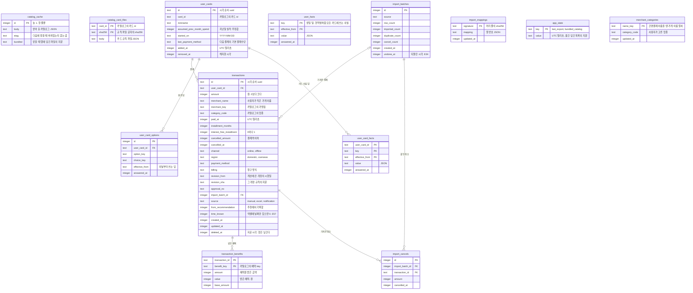

# 체리컨슘 ERD

폰 안 SQLite 기준. 2026-10-02 작업 006에서 서버의 Postgres 표 23개를 폰 안 표 10개로 바꿨다. 2026-10-05 작업 012에서 앱 상태 표를, 작업 014에서 카드 규칙 파일 표를 더해 12개다. 표 정의는 `app/lib/store/db.dart`의 번호 붙은 SQL 목록이다. 작업 006 설계 4절

- 사용자가 한 명이라 모든 표에 `user_id`가 없다. 계정, 로그인 수단, 세션 표는 없다
- 카드사, 카드, 개정, 업종, 가맹점, 별칭, 결제수단 표는 없다. 메모리의 카탈로그가 대신한다. 결제는 카탈로그의 key를 글자로 가리킨다
- 추천 요청과 추천 결과 표는 없다. 결제에 "추천에서 기록함" 표시 하나만 둔다
- 시각은 UTC 밀리초 정수, 날짜는 `YYYY-MM-DD` 글자, 참과 거짓은 0과 1이다. 받아 둔 카탈로그 표 말고는 모두 strict라 칸의 형이 틀린 값을 DB가 막는다

## 설계 메모

- 카드와 가맹점은 카탈로그에서 지우지 않는 것이 규칙이다. 그래도 받은 카탈로그에 보유 카드, 해지한 카드, 저장한 결제의 카드나 가맹점, 업종, 결제수단이 없으면 그 파일을 쓰지 않고 가진 것을 쓴다. 작업 006 설계 2절, 4절
- 결제는 계산에 쓴 개정을 `revision_from`과 `revision_sha`로, 받은 혜택을 `transaction_benefits`의 혜택 key로 가리킨다. 혜택 key는 갱신해도 바꾸지 않는다. 한도 사용량은 기간 안의 `transaction_benefits`를 모아 계산한다. 저장한 혜택은 다시 계산하지 않는다. E18. 예외는 달이 끝난 순위 카드, 결제한 달 기준 취소로 구간이 바뀐 달, 엑셀이나 손으로 앞선 결제가 들어온 달, 지난달 결제로 구간이 바뀐 달, 결제를 고치거나 지우거나 취소해 구간이 바뀐 다음 달, 카드 사실이나 옵션을 답한 카드다. E48, E5, E51, E52, E53, E54, E56
- `user_cards`는 같은 카드를 두 번 보유할 수 없게 `card_id`에 `removed_at IS NULL` 조건의 부분 유니크 인덱스를 둔다. E21
- 실적 계산은 `transactions`를 `(user_card_id, paid_at)`으로 읽는다. 이 두 칸의 복합 인덱스가 핵심 인덱스다
- 결제 id는 시각 순서 uuid라 같은 시각 결제를 id 순서로 세우면 먼저 넣은 결제가 하루 1회 한도를 쓴다. 새 id는 저장된 가장 큰 id보다 늘 크다
- 금액은 0보다 큰 정수이고 취소액은 결제액 이하다. 취소액이 있으면 취소 시각도 있다. 화면이 실수해도 DB가 막는다
- `transactions.source`는 결제가 어디서 들어왔는지다. 결제 알림으로 들어온 결제는 승인번호가 없어 같은 카드, 같은 금액, 시각 10분 이내로 겹침을 본다. 알림 초안과 카드번호 끝 4자리 짝은 이 DB에도 넣지 않는다. 설계 문서 9절
- `import_batches.source`는 가져온 파일의 모양이다. `xlsx`, `html`, `csv` 가운데 하나이고 확장자가 아니라 내용으로 가린다. 파일 이름은 이름과 카드번호 끝자리가 들어 있을 수 있어 남기지 않는다. 기록 가져오기는 이 셋이 아닌 값이 든 파일을 받지 않는다. 2026-10-05 작업 013
- 엑셀 가져오기는 같은 카드의 같은 승인번호를 한 번만 받는다. `(user_card_id, approval_no)`에 `approval_no IS NOT NULL AND deleted_at IS NULL` 조건의 부분 유니크 인덱스를 둔다. E31
- 엑셀 가져오기가 붙인 취소는 `import_cancels`에 한 줄씩 둔다. 결제의 `cancelled_amount`는 이 줄들과 앱에서 적은 취소의 합이다. 묶음을 되돌리면 그 묶음의 취소만 뺀다. E32, E34
- `import_mappings`는 사용자가 짝지은 열이다. 머리 줄의 sha256마다 하나이고 열 이름 대신 열 번호만 남긴다. 기록 내보내기에 담지 않는다. E30
- `app_state`는 기록이 아닌 앱 상태다. 마지막으로 기록을 내보낸 시각 `last_export`와 표로 옮긴 담긴 목록 파일의 지문 `bundled_catalog`다. 설정의 기록 내보내기 줄이 `last_export`로 "마지막으로 내보낸 날"을 보인다. 작업 012 설계 4절
- `catalog_card_files`는 카드 규칙 파일을 지문마다 한 줄로 둔다. 앱에 담긴 파일은 앱 판이 바뀐 뒤 처음 켤 때 옮기고, 받은 파일은 지문을 확인해 넣는다. 켤 때 담긴 목록과 받아 둔 목록이 가리키지 않는 줄을 지운다. 앱 판이 바뀐 뒤부터 `catalog_cache.body`는 한 벌 카탈로그가 아니라 목록 파일이다. 작업 014 설계 2절
- `merchant_categories`는 사용자가 고른 가게 이름별 업종이다. 열쇠는 간편결제 이름과 영문 괄호, 회사 표시, 띄어쓰기를 뺀 가게 이름이고 원래 이름은 두지 않는다. 결제의 업종을 정할 때 가맹점 업종보다 먼저 쓴다. 기록 내보내기에 담는다. 작업 016 설계 3절, E62
- 설정의 기록 내보내기는 `catalog_cache`, `catalog_card_files`, `import_mappings`, `app_state`를 뺀 표 아홉을 JSON 한 파일로 쓴다. 표마다 표나 칸이 마지막으로 바뀐 표 정의 번호를 두어, 그보다 옛 번호 파일에는 그 표가 없어도 받는다. 가져오기는 한 트랜잭션에서 표를 비우고 파일의 행을 넣는다. 작업 006 설계 6절
- 표 정의는 칸과 표를 더하기만 하고 새 칸에는 기본값을 둔다. `PRAGMA user_version`에 돌린 번호를 적고, 이미 낸 번호의 SQL은 고치지 않고 새 번호로 더한다
